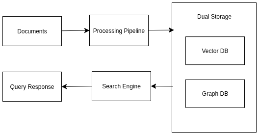
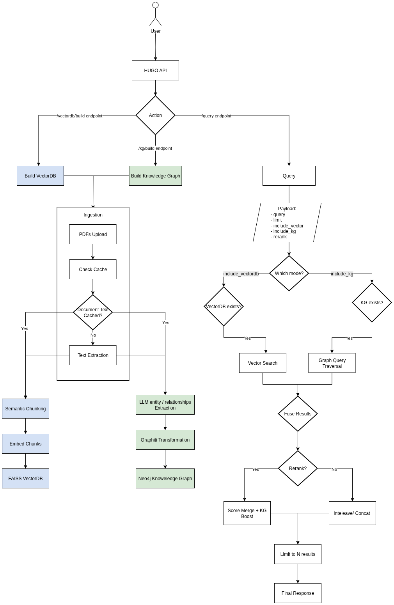

**RAGraph - Research & Dev Project about Graphs and RAG**

<div align="center">

[](https://www.docker.com/)
[](https://fastapi.tiangolo.com/)
[](https://neo4j.com/)
[](https://www.python.org/)

*A modular Graph-RAG microservice combining traditional retrieval with temporal knowledge graphs for enhanced document understanding*

</div>

## Overview

RAGraph is a cutting-edge hybrid retrieval-augmented generation (RAG) system that combines traditional vector search with knowledge graph reasoning. Built for enterprise-grade document understanding, it transforms simple keyword matching into contextual relationship reasoning through sophisticated graph structures and semantic chunking.

### Core Value Proposition

- **Enhanced Accuracy**: Graph-based reasoning improves answer quality for relationship-heavy queries
- **Complete Explainability**: Transparent reasoning paths through graph-based evidence trails
- **Temporal Intelligence**: Time-bounded fact management and entity lifecycle tracking
- **Data Sovereignty**: Self-hosted deployment using local models for complete control
- **Real-time Updates**: Dynamic graph updates without full re-indexing requirements

## System Architecture

### High-Level Architecture




### WorkFlow Architecture




## Key Features

### Hybrid Retrieval System
- **Vector Search**: Semantic similarity using FAISS with local embeddings
- **Graph Traversal**: Relationship-aware reasoning through Neo4j
- **Intelligent Reranking**: Combines results with relevance scoring
- **Fallback Mechanisms**: Robust error handling and graceful degradation

### Knowledge Graph Management
- **Entity Extraction**: Automated identification of key entities and relationships
- **Temporal Awareness**: Time-bounded assertions and lifecycle management  
- **User Isolation**: Strict multi-tenancy with user-scoped data segregation
- **Real-time Updates**: Incremental graph building without full rebuilds

### Advanced Document Processing
- **Multi-format Support**: Primary focus on PDF with extensible architecture
- **GPU Acceleration**: Docling converter with CUDA support
- **Semantic Chunking**: Context-aware text segmentation
- **Fallback Processing**: PDFplumber backup for reliability

### Enterprise Features
- **Multi-tenant Architecture**: Complete user isolation and data segregation
- **Health Monitoring**: Comprehensive system health checks
- **Caching Layer**: Intelligent embedding and document caching
- **Docker Deployment**: Containerized with Docker Compose orchestration

## Technology Stack

| Component | Technology | Purpose |
|-----------|------------|---------|
| **API Framework** | FastAPI | High-performance async web framework |
| **Graph Database** | Neo4j | Knowledge graph storage and querying |
| **Vector Search** | FAISS | Efficient similarity search |
| **Document Processing** | Docling + PDFplumber | PDF text extraction and processing |
| **Embeddings** | HuggingFace Transformers | Local embedding generation |
| **LLM Integration** | Azure OpenAI | Advanced language processing |
| **Containerization** | Docker + Compose | Deployment and orchestration |
| **Semantic Chunking** | LangChain | Intelligent text segmentation |

## Prerequisites

### System Requirements
- **Docker & Docker Compose**: Latest versions
- **Python**: 3.10+ (for development)
- **Memory**: 8GB+ RAM recommended
- **GPU**: Optional CUDA support for accelerated processing

### Required Credentials
- **Azure OpenAI**: API key and endpoint
- **Neo4j**: Database credentials (provided via environment)

## Quick Start

### 1. Clone Repository
```bash
git clone <repository-url>
cd hugo
```

### 2. Environment Setup
Create `.env` file with required credentials:
```env
# Neo4j Configuration
NEO4J_URI=bolt://neo4j:7687
NEO4J_USER=neo4j
NEO4J_PASSWORD=your_password
NEO4J_AUTH=neo4j/your_password

# Azure OpenAI Configuration
AZURE_OPENAI_API_KEY=your_api_key
AZURE_OPENAI_ENDPOINT=https://your-endpoint.openai.azure.com/
AZURE_OPENAI_API_VERSION=2023-12-01-preview
AZURE_OPENAI_CHAT_DEPLOYMENT=your_chat_model
AZURE_OPENAI_EMBEDDINGS_DEPLOYMENT=your_embeddings_model
```

### 3. Deploy with Docker
```bash
# Make script executable
chmod +x scripts/docker-up.sh

# Start all services
./scripts/docker-up.sh
```

### 4. Verify Deployment
```bash
# Check service status
docker compose ps

# Test API health
curl http://localhost:8000/health
```

### 5. Access Services
- **API Documentation**: http://localhost:8000/docs
- **Neo4j Browser**: http://localhost:7474
- **API Health Check**: http://localhost:8000/health

## API Usage

### Authentication & User Management
All endpoints require a `user_id` parameter for multi-tenant data isolation.

### Document Ingestion

#### Build Knowledge Graph
```bash
curl -X POST "http://localhost:8000/kg/build" \
  -F "user_id=user123" \
  -F "force_rebuild=false" \
  -F "files=@document1.pdf" \
  -F "files=@document2.pdf"
```

#### Build Vector Store
```bash
curl -X POST "http://localhost:8000/vectordb/build" \
  -F "user_id=user123" \
  -F "force_rebuild=false" \
  -F "files=@document1.pdf"
```

### Query Processing

#### Hybrid Search Query
```bash
curl -X POST "http://localhost:8000/query" \
  -H "Content-Type: application/json" \
  -d '{
    "user_id": "user123",
    "query": "What are the key financial metrics?",
    "limit": 10,
    "include_kg": true,
    "include_vector": true,
    "rerank": true
  }'
```

### System Management

#### Check System Status
```bash
# Knowledge Graph Status
curl -X POST "http://localhost:8000/kg/status" \
  -H "Content-Type: application/json" \
  -d '{"user_id": "user123"}'

# Vector Store Status  
curl -X POST "http://localhost:8000/vectordb/status" \
  -H "Content-Type: application/json" \
  -d '{"user_id": "user123"}'
```

#### Clear User Data
```bash
# Clear Knowledge Graph
curl -X POST "http://localhost:8000/kg/clear" \
  -H "Content-Type: application/json" \
  -d '{"user_id": "user123"}'

# Clear Vector Store
curl -X POST "http://localhost:8000/vectordb/clear" \
  -H "Content-Type: application/json" \
  -d '{"user_id": "user123"}'
```

## Development Setup

### Local Development
```bash
# Create virtual environment
python -m venv venv
source venv/bin/activate  # On Windows: venv\Scripts\activate

# Install dependencies
pip install -r requirements.txt

# Start development server
python -m uvicorn api.main:app --reload --host 0.0.0.0 --port 8000
```


## License

This project is licensed under the Apache License 2.0 - see the [LICENSE](LICENSE) file for details.

## Contributing

1. Fork the repository
2. Create a feature branch
3. Make your changes
4. Add tests if applicable
5. Submit a pull request
